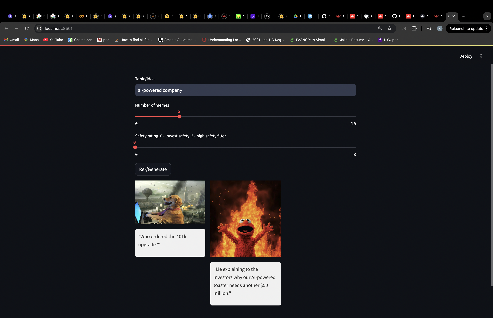

# Meme-gen

A streamlit app that generates memes with natural-language prompts.

To run, add your gemini keys in llm.py file and then run,
```
streamlit run  main.py
```

## A few samples




## Implementation-details
1. From a dataset of meme templates [link](https://drive.google.com/drive/folders/1UXKquhbrh_aC48FeqY60TW6YXls9gAMD), best k memes are selected based on similarity with the user-provided prompt. The similarity is
   measured by a sentence-transformer using the given prompt and meme-template description.
2. Then, for each of the selected template, the template image is given to Gemini-1.5-Pro to generate the corresponding text.
3. The user is provided with controls to change the LLM content's safety level, which is handled by their api. In case, the safety level of produced image is not appropriate, a message is shown for the same.
4. In case the user is not satisfied with the text, a re-generate button is provided to generate the texts again.

## Things to improve
1. The generation is slow since the templates are stored on streamlit server and need to uploaded to gemini and it can be made faster if stored on gcp.
2. A few in-context examples can be provided in the prompt, which could be meme-template and corresponding text.
3. If a small annotated dataset of meme-template and their caption is available, the sentence-transformer can be fine-tuned to improve matching between given prompt and the meme-template.